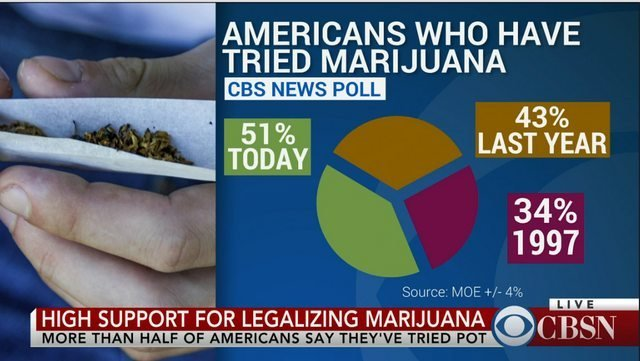
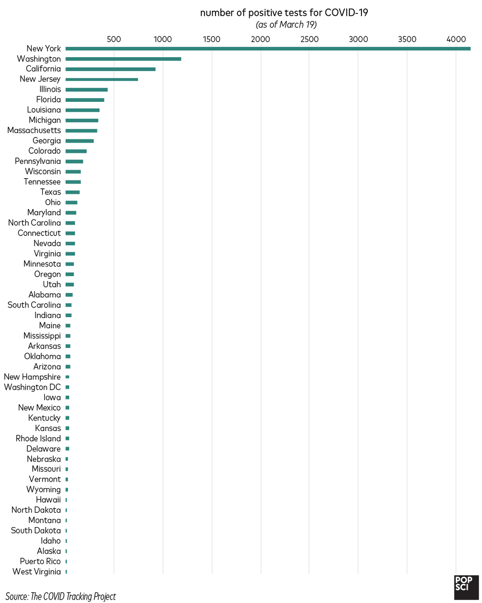
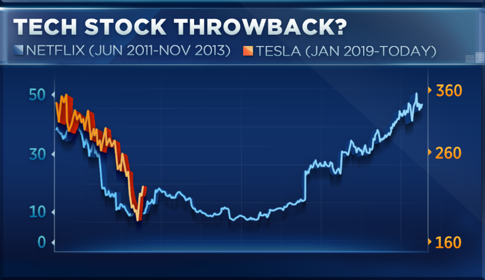

# Infographie Trompeuse

## Américain qui ont essayé le Marijuana

Le choix du camembert pour représenter ce graphique est très mauvais car le total des pourcentages ne fait pas 100% et surtout ce sont des données d'années différentes donc ils auraient dû mettre les informations de manière séparée au lieu de les faire rentrer dans un graphique.

## Nombre positif de test pour le COVID-19

L'information ici est mensongère car ça ne compare pas le nombre de tests positifs avec le nombre de tests tout court donc l'information peut être mensongère.

## Retour en arrière de la technologie

Ici les dates ne sont pas les mêmes et les axes des deux bars ne sont pas les mêmes, ce qui amène des incompréhensions.

